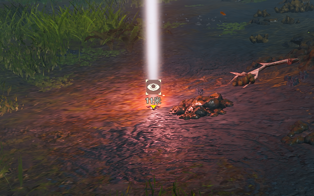

# HELLDIVERS2-Navigation_Stratagem_Ball

本 MOD 可以把战备球瞬移到玩家标点处。  
This mod teleports your stratagem ball to the spot you pinged.

## 安装方法 / Installation

需要 BingusSharedLoader V18，使用 HD2-ARSENAL 安装，并把 BingusSharedLoader V18 放在加载列表的最底部。  
Requires BingusSharedLoader V18. Install it with HD2-ARSENAL, and put BingusSharedLoader V18 at the bottom of the load order.

## 使用方法 / Usage

拿出战备球并激活 → 标点 → 屏幕下方 HUD 出现 `ready` → 在 3 秒内投出战备球。  
Take out and arm a stratagem ball → ping a spot → `ready` appears on the HUD at the bottom of the screen → throw the ball within 3 seconds.

## 注意事项 / Notes

1. 多人游戏或者复活时需要先投出一个战备球（为了获取玩家地址）。  
   In multiplayer, or right after a respawn, you need to throw one stratagem ball first (this is how the mod learns the player's address).
2. 传送有可能失败。  
   The teleport may fail sometimes.

## 其他信息 / Miscellaneous

构建于游戏版本：Steam build 25480438（helldivers2.exe 1.8.46015.0）。  
Built on game version: Steam build 25480438 (helldivers2.exe 1.8.46015.0).

**AI 信息披露**：DeepSeek 协助研究、实施、调试、文档编写。  
**AI disclosure**: DeepSeek assisted with research, implementation, debugging and documentation.

### 友情链接 / Friendly links

- HD2 Lua 加载器 / HD2 Lua loader：[BingusSharedLoader](https://github.com/CowboyBingus/BingusSharedLoader)
- HD2 解包资源 / HD2 unpacked game data：[Darctor/Helldivers2_RawData](https://github.com/Darctor/Helldivers2_RawData)

### 反馈 / Feedback

如果你遇到任何问题，可以把日志发给我 —— 日志在 `%LOCALAPPDATA%\CowboyBingus\Helldivers2\Logs\`（`NavigationStratagemBall*.log`），按 Win+R 把这段路径粘进去就能打开文件夹；可以通过 GitHub 提 issue，或者直接在评论区发。  
If you run into any problem, feel free to send me the logs — they are in `%LOCALAPPDATA%\CowboyBingus\Helldivers2\Logs\` (`NavigationStratagemBall*.log`); paste that path into Win+R to open the folder. You can open a GitHub issue, or just post them in the comments.
